<!-- ═══════════════════════════  HEADER  ═══════════════════════════ -->

  

  

  
  
  
  

  
  
  
  

<!-- ═══════════════════════════  ABOUT  ═══════════════════════════ -->
## 👋 About Me

  

- 🏛️ &nbsp;**Full-Stack Developer at IIT Bhilai** — building and running real systems for real users
- 💻 &nbsp;**MERN specialist** — React on the front, Node/Express on the back, MongoDB *and* Postgres where each fits
- 🧠 &nbsp;**Architecture-first mindset** — caching, queues, indexing, RBAC, and designing for the load you'll have next year
- 🚀 &nbsp;**Indie builder** — I ship and maintain my own web tools used by the public
- 🎓 &nbsp;Bachelor's degree — but most of what I know came from production code
- 💬 &nbsp;**Ask me about** — Node.js backends, database design, scaling web apps, SEO for tool sites
- 📫 &nbsp;**Reach me** — [developer.anubhav@gmail.com](mailto:developer.anubhav@gmail.com)

<!-- ═══════════════════════════  PROJECTS  ═══════════════════════════ -->
## 🚀 Featured Projects

<table>
  <tr>
    <td width="50%" valign="top">
      <h3>🧮 <a href="https://freecalculatorworld.com">FreeCalculatorWorld</a></h3>
      
A free online calculator platform — fast, ad-supported, SEO-driven tools that people use for everyday maths, finance and conversions.

      

        
        
      

    </td>
    <td width="50%" valign="top">
      <h3>🖼️ <a href="https://pixshrink.com">PixShrink</a></h3>
      
A browser-based image editor — compress, resize and edit images right in the browser, with nothing to install.

      

        
        
      

    </td>
  </tr>
</table>

<!-- ═══════════════════════════  TECH STACK  ═══════════════════════════ -->
## 🛠️ Tech Stack

<table align="center">
  <tr>
    <td align="center"><b>💬 Languages</b></td>
    <td></td>
  </tr>
  <tr>
    <td align="center"><b>🎨 Frontend</b></td>
    <td></td>
  </tr>
  <tr>
    <td align="center"><b>⚙️ Backend</b></td>
    <td></td>
  </tr>
  <tr>
    <td align="center"><b>📱 Mobile</b></td>
    <td></td>
  </tr>
  <tr>
    <td align="center"><b>🗄️ Data</b></td>
    <td></td>
  </tr>
  <tr>
    <td align="center"><b>☁️ Cloud & DevOps</b></td>
    <td></td>
  </tr>
  <tr>
    <td align="center"><b>🤖 AI / ML</b></td>
    <td></td>
  </tr>
  <tr>
    <td align="center"><b>🧰 Tools & Design</b></td>
    <td></td>
  </tr>
</table>

<b>➕ Also comfortable with</b>

 

`React Native` · `Expo` · `Ionic` · `React Query` · `React Hook Form` · `React Router` · `Chakra UI` · `Radix UI` · `Vuetify` · `Fastify` · `CodeIgniter` · `Django REST` · `MariaDB` · `SQL Server` · `Oracle` · `DigitalOcean` · `Apache` · `Maven` · `Puppeteer` · `Playwright` · `Swagger` · `Jira` · `NumPy` · `Matplotlib` · `OpenGL` · `Qt` · `Lightroom` · `Canva` · `Sketch`

<!-- ═══════════════════════════  STATS  ═══════════════════════════ -->
## 📊 GitHub Analytics

  
  

<!-- ═══════════════════════════  SNAKE  ═══════════════════════════ -->
## 🐍 Contribution Snake

  <picture>
    <source media="(prefers-color-scheme: dark)" srcset="https://raw.githubusercontent.com/anubhav-codes/anubhav-codes/output/github-snake-dark.svg"/>
    <source media="(prefers-color-scheme: light)" srcset="https://raw.githubusercontent.com/anubhav-codes/anubhav-codes/output/github-snake.svg"/>
    
  </picture>

<!-- ═══════════════════════════  QUOTE  ═══════════════════════════ -->
## ✍️ Random Dev Quote

  

<!-- ═══════════════════════════  FOOTER  ═══════════════════════════ -->

  

  

